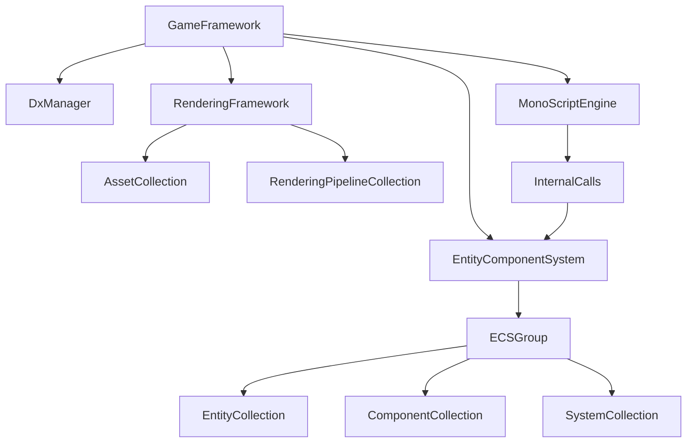

# ONEngine (TD4-2) エンジン構造書 - フェーズ1: 俯瞰構造

本ドキュメントは、ONEngine（TD4-2）の全体像と主要コンポーネントの責務をまとめたものである。

## 1. 全体設計方針

*   **言語**: エンジンコアは C++20、スクリプト層は C# を使用。
*   **グラフィックス**: DirectX 12 を採用。特に Mesh Shader を前提とした設計。
*   **スクリプトエンジン**: Mono を使用した C# 統合。
*   **アーキテクチャ**: データ指向の **Entity Component System (ECS)** を中核に据えている。
*   **モジュール化**: `GameFramework` が各サブシステム（Graphics, ECS, Window, Script 等）を管理・実行する。

## 2. ディレクトリ構造

```text
C:\Users\k023g\source\repos\TD4-2\Project\Engine\
├── Asset\      # アセット管理（テクスチャ、モデル等）
├── Core\       # 基盤システム（DX12, Window, Threading, Utility）
├── ECS\        # データ構造（Entity, Component, System, Prefab）
├── Editor\     # 開発ツール（ImGui, エディタ機能）
├── Graphics\   # 描画パイプライン、バッファ、シェーダー管理
├── Scene\      # シーン管理、シリアライズ（JSON）
└── Script\     # C#スクリプトエンジンのブリッジ（Mono）
```

## 3. 主要サブシステム

### 3.1 Core (基盤層)
*   **DxManager**: DX12デバイス、コマンドリスト、記述子ヒープ等のライフサイクル管理。
*   **WindowManager**: Win32 API をラップしたウィンドウ管理。
*   **ThreadPool**: 非同期処理のためのスレッドプール。
*   **FrameEventQueue**: フレーム内でのイベント通知システム。

### 3.2 ECS (データ・ロジック層)
*   **ECSGroup**: シーンごとにエンティティとコンポーネントを分離管理するコンテナ（"GameScene", "Debug" 等）。
*   **Component**: 純粋なデータ保持。`ComponentArray` で効率的に管理。
*   **System**: コンポーネント群を走査してロジックを実行。
*   **Entity**: IDベースのオブジェクト管理。親子構造をサポート。

### 3.3 Graphics (描画層)
*   **RenderingFramework**: 描画のメインオーケストレーター。
*   **RenderingPipeline**: パイプラインステート（PSO）やシェーダーの組み合わせを定義。
*   **SceneRenderTexture**: G-Buffer や最終出力用のテクスチャ管理。
*   **AssetCollection**: グラフィックスリソース（テクスチャ、メッシュ）の管理。

### 3.4 Scripting (連携層)
*   **MonoScriptEngine**: C# ランタイム（Mono）の初期化と実行。
*   **InternalCalls**: C++ 側の ECS 操作などを C# から呼び出すためのブリッジ関数群。

### 3.5 Editor (ツール層)
*   **ImGuiManager**: ImGui の描画と入力を管理。
*   **EditorManager**: プロパティ編集やシーンビュー、アセットブラウザ等のエディタ機能。

## 4. エンジン実行サイクル (GameFramework::Run)

1.  **Input / Time Update**: 入力状態とデルタタイムの更新。
2.  **Editor Update**: エディタ UI の更新。
3.  **ECS Update**: 
    *   `DebuggingUpdate`: デバッグ用の更新。
    *   `OutsideOfUpdate`: シーン外の更新。
    *   `Scene Update`: シーン固有のロジック。
    *   `Entity Update`: 各エンティティのコンポーネント更新。
4.  **Event Flush**: キューに溜まったイベントの処理。
5.  **Render**: 
    *   `RenderingFramework::Draw`: 登録されたパイプラインに従って描画。
    *   ImGui (Editor) の描画。
6.  **Window Message**: OS メッセージの処理。

---
*次フェーズでは、各ディレクトリ内部のクラス構成やクラス間の依存関係を詳細に記述する予定。*

## 5. 各コンポーネントの詳細実装 (フェーズ2)

### 5.1 DirectX 12 リソース管理
*   **DxSRVHeap (記述子ヒープ管理)**:
    *   SRV(Texture), UAV(Texture), Buffer 用の領域を内部で分割管理（`HeapData` 構造体）。
    *   `AllocateTexture()`, `AllocateBuffer()` 等により、インデックスベースでの動的確保が可能。
    *   空きインデックスは `std::deque<uint32_t> spaceIndex` で再利用管理されている。
*   **DxCommand (コマンド実行)**:
    *   `ID3D12GraphicsCommandList6` を使用。
    *   `CommandExecuteAndWait()` による同期実行と、`WaitForGpuComplete()` によるフェンス同期をサポート。

### 5.2 ECS (Entity Component System) の詳細
*   **ECSGroup**:
    *   `EntityCollection`, `ComponentCollection`, `SystemCollection` を内包。
    *   `GenerateEntityFromPrefab` により、アセットベースのエンティティ生成が可能。
    *   `AddSystem<Sys>(args...)` でシステムを動的に追加し、`RuntimeUpdateSystems()` で一括更新を行う。
*   **ComponentArray**:
    *   特定のコンポーネント型ごとに連続したメモリ領域で管理（データ指向設計）。
    *   `GetUsedComponents()` により、現在有効なコンポーネントのみを効率的に走査可能。

### 5.3 描画パイプライン (Mesh Rendering)
*   **MeshRenderingPipeline**:
    *   **RenderQueue**: `Background`, `Telegraph` (Z-Test無視), `Default` の3段階で描画順を制御。
    *   **Mesh Shader 対応**: パイプライン内で `vs_6_0`, `ps_6_0` を使用。
    *   **インスタンシング**: `DrawIndexedInstanced` を使用し、同一メッシュをまとめて描画。
    *   **定数バッファ**: `ViewProjection` は `AddCBV` で直接バインド、`Transform` や `Material` は `DescriptorTable` を介して構造化バッファとして提供。
*   **ShaderCompiler**: `IDxcCompiler3` を使用した HLSL コンパイル環境を提供。

### 5.4 C# スクリプト統合 (Mono Bridge)
*   **InternalCalls**:
    *   `mono_add_internal_call` を使用して、C++ 側の機能を C# クラス（`Transform`, `MeshRenderer`, `Input` 等）に公開。
    *   **Gizmo 連携**: `Internal_SubmitLineBatch` のように、C# 側で生成した描画データを C++ 側の Gizmo システムにバッチ転送する仕組みを持つ。
    *   **ECS 操作**: エンティティの生成・削除、コンポーネントの取得・設定を C# からシームレスに行える。

## 6. クラス間依存関係図 (主要)



---
*次フェーズでは、アセットパイプライン（Asset/Meta）とシリアライズの詳細、およびマルチスレッド設計について調査する。*

## 7. 実践的なシステム設計 (フェーズ3)

### 7.1 アセットパイプラインとメタデータ
*   **MetaFile (JSON方式)**:
    *   すべてのアセット（.png, .obj等）に対して `.meta` ファイルを生成・付随させる。
    *   **MetaBase**: `Guid`（一意識別子）、`AssetType`、依存関係リスト（`dependencies`）を保持。
    *   GUIDベースの参照管理により、ファイル名やパスが変更されてもリンクが壊れない設計。
*   **AssetCollection**: メモリ上のリソース（Texture, Model, Prefab）をハッシュマップで一括管理。

### 7.2 シリアライズとシーン管理 (SceneIO)
*   **モジュール化されたシリアライズ**:
    *   `.scene` ファイル：シーンに含まれるエンティティの参照（GUID/Path）のみを保持。
    *   `.entity` ファイル：エンティティごとのコンポーネントデータを独立して保持。
    *   **利点**: 大規模シーンでも Git 等のバージョン管理で競合が起きにくく、特定エンティティのみの復元が容易。
*   **C#同期**: シーンロード完了後、`SyncInitialComponentsToCS()` により C++ 側の初期状態を C# スクリプト層へ一括同期。

### 7.3 マルチスレッド設計 (ThreadPool)
*   **WorkerContext**:
    *   各ワーカースレッドが専用の `DxUploadCommand` を保持。
    *   アセットのロードやリソース生成をバックグラウンドスレッドで安全に行い、メインスレッドを止めずに GPU へデータを転送可能。
*   **ConcurrentQueue**: スレッドセーフなジョブキューにより、タスクを効率的に分配。

### 7.4 エディタ・アーキテクチャ (EditorManager)
*   **Command Pattern**:
    *   `IEditCommand` を継承した各種コマンド（移動、削除、値変更等）を `ExecuteCommand` で実行。
    *   `commandStack_` と `redoStack_` による Undo/Redo 機能の実装。
*   **EditorCompute**: コンピュートシェーダーを用いたエディタ専用の計算処理をプラグイン形式で追加可能。

## 8. 実際のプロジェクト構成

```text
C:\Users\k023g\source\repos\TD4-2\Project\
├── Assets\         # 素材（Models, Textures, Sounds, Fonts）
│   └── Scene\      # シーンデータ（.sceneファイルとエンティティフォルダ）
├── Packages\       # エンジン標準リソース
│   └── Shader\     # HLSLシェーダー（Mesh, Sprite, Skybox等）
├── SubProjects\    # スクリプトプロジェクト
│   ├── CSharpLibrary\      # C#の基盤ライブラリ
│   └── ONEngine.Scripting\ # ユーザー用スクリプト
└── EngineStructure.md # 本書
```

## 9. 結論

ONEngineは、最新の DirectX 12 技術（Mesh Shader）を中核に据えつつ、ECS による高性能なデータ処理と、Mono による柔軟なスクリプト開発環境を両立させた、プロフェッショナルかつ拡張性の高いゲームエンジンである。特にシリアライズの細分化やワーカースレッドごとのGPUコンテキストなど、実務におけるチーム開発やパフォーマンスを重視した設計が随所に見られる。
